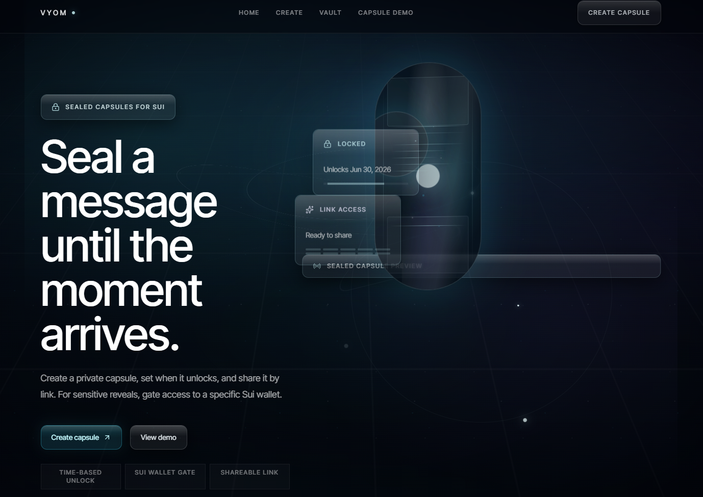
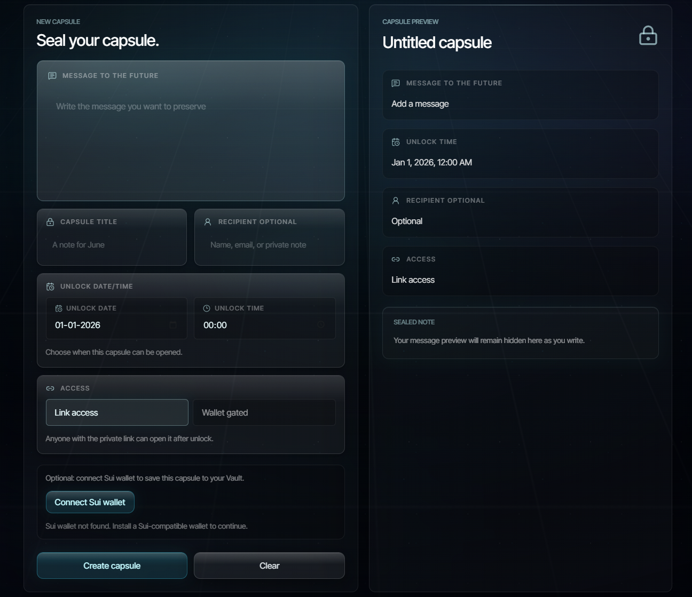
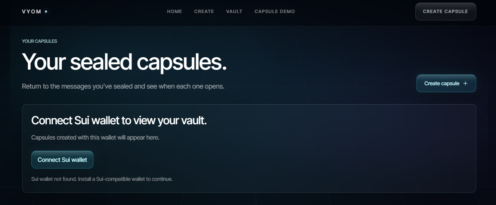
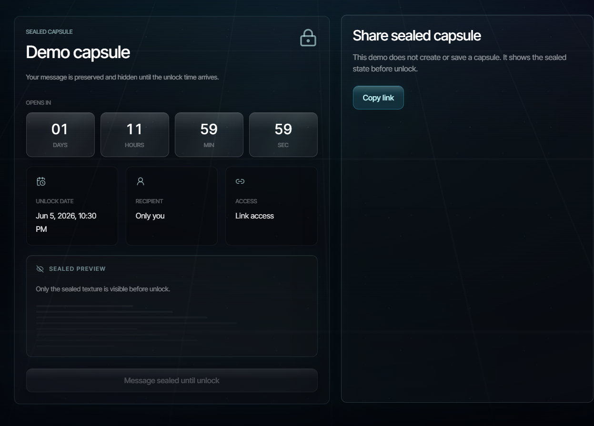

# Vyom

Time-locked digital capsules with Sui wallet reveal flows.

Live: https://vyom-capsules.netlify.app  
Project page: https://www.deepsurge.xyz/projects/0dae0be7-489c-467f-b27c-c66cd1208d96  
Repo: https://github.com/vaibhav0xq/vyom

## Overview

Vyom lets users create sealed digital capsules, schedule when they unlock and choose how they can be revealed.

The current release supports direct capsule links, Sui wallet gated reveal, a wallet-owned vault and a minimal Sui Testnet registry package.

## Screenshots

### Homepage

### Capsule creation

### Wallet-owned vault

### Demo capsule

## What it does

Vyom lets users:

- Create a sealed capsule
- Set an unlock date and time
- Share a capsule through a direct link
- Reveal capsules after the unlock time
- Restrict reveal to a specific Sui wallet
- View wallet-owned capsules in a vault
- Preview the flow through a demo capsule

## Access modes

### Link access

A link access capsule can be revealed by anyone with the capsule link after the unlock time has passed.

### Wallet gated

A wallet gated capsule requires the recipient to connect the matching Sui wallet before the capsule content is revealed.

## Sui integration

Vyom uses Sui wallet identity as part of its capsule access model.

The current release includes:

- Sui wallet connection through Mysten dApp Kit
- Wallet gated reveal based on a recipient Sui address
- Wallet-owned vault discovery based on the connected Sui wallet
- A minimal Sui Testnet registry package used as an onchain project marker

### Sui Testnet package

Network: Sui Testnet  
Package ID: `0x6824b764de764bfb1d55ec4bc55fb93f4371c7877b696d94258282990991230c`  
Transaction Digest: `J928hnejDaYXgkcRNcYLuC6y4qeYU2Nnmzg9qHfqr9gV`  
Shared Project Object: `0x7d807eb8e941ec18398167fdef788eeecb8c87a3632772bd72d52124a43ef701`

## Technical stack

- Next.js App Router
- React
- TypeScript
- Tailwind CSS
- Mysten dApp Kit
- Sui Move
- Sui Testnet
- Server-side route handlers
- Wallet-based vault identity

## Project structure

- `app/` - Application routes and API routes
- `components/vyom/` - Vyom UI components
- `hooks/` - Client hooks
- `lib/` - Capsule access and utility logic
- `move/vyom_registry/` - Minimal Sui Move package
- `public/assert/` - Screenshots and public assets
- `types/` - Capsule types

## Move package

Vyom includes a minimal Move package under `move/vyom_registry`.

Build the Move package:

`cd move/vyom_registry`  
`sui move build`

Publish the Move package:

`sui client switch --env testnet`  
`sui client publish --gas-budget 100000000`

## Local development

Install dependencies:

`npm install`

Start the development server:

`npm run dev`

Open the app locally:

`http://localhost:3000`

## Available scripts

- `npm run dev`
- `npm run lint`
- `npm run build`
- `npm run start`

## Validation

The current release has been validated with:

- `npm run lint`
- `npm run build`

Core flows tested:

- Homepage loads correctly
- Capsule creation works
- Link access capsules open after unlock
- Wallet gated capsules require the matching Sui wallet
- Vault shows capsules owned by the connected wallet
- Wallet connect and disconnect flow works
- Demo capsule route loads correctly
- Sui Testnet registry package builds and publishes successfully

## Security positioning

Vyom currently provides app-level sealed reveal behavior and wallet gated access logic.

The current wallet gated reveal is implemented at the application layer. The interface enforces the reveal flow based on the connected wallet address, but capsule contents are not yet protected by client-side encryption or signature-based cryptographic unlock.

This is an intentional release boundary for the current version.

Planned hardening includes:

- Client-side encryption before capsule persistence
- Signature-based unlock verification
- Onchain or hybrid access registries
- Stronger capsule ownership and recovery model
- Media capsules
- One-time reveal capsules
- NFT-based access conditions
- Payment-based unlock conditions
- Richer programmable reveal logic

## Current status

Vyom is live with the core capsule workflow implemented end to end:

- Capsule creation
- Scheduled unlocks
- Direct capsule links
- Link access reveal
- Sui wallet gated reveal
- Wallet-owned vault
- Sui wallet connect and disconnect
- Demo capsule route
- Minimal Sui Testnet registry package

Future work will focus on stronger cryptographic enforcement, richer access conditions and deeper Sui integration.

## License

MIT
